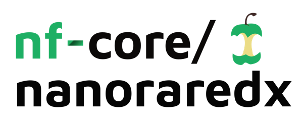

<h1>
  <picture>
    <source media="(prefers-color-scheme: dark)" srcset="docs/images/nf-core-nanoraredx_logo_dark.png">
    
  </picture>
</h1>

[](https://github.com/nf-core/longraredisease/actions/workflows/ci.yml)
[](https://github.com/nf-core/longraredisease/actions/workflows/linting.yml)
[](https://nf-co.re/longraredisease/results)
[](https://doi.org/10.5281/zenodo.XXXXXXX)
[](https://www.nf-test.com)

[](https://www.nextflow.io/)
[](https://docs.conda.io/en/latest/)
[](https://www.docker.com/)
[](https://sylabs.io/docs/)
[](https://cloud.seqera.io/launch?pipeline=https://github.com/nf-core/longraredisease)

[](https://nfcore.slack.com/channels/longraredisease)
[](https://twitter.com/nf_core)
[](https://mstdn.science/@nf_core)
[](https://www.youtube.com/c/nf-core)

---

## Introduction

**longraredisease** is a comprehensive Nextflow pipeline for Oxford Nanopore sequencing analysis, designed for rare disease research and diagnostics. It delivers high-confidence variant discovery by integrating multiple state-of-the-art tools. longraredisease performs multi-caller structural variant (SV) detection, single nucleotide variant (SNV) calling, copy number variant (CNV) analysis, short tandem repeat (STR) detection, and phasing analysis in a reproducible, modular workflow.

**Pipeline Overview**  
- **Structural Variants (SVs):** Sniffles, CuteSV, SVIM, with SURVIVOR merging  
- **Single Nucleotide Variants (SNVs):** Clair3, DeepVariant  
- **Copy Number Variants (CNVs):** Spectre, QDNAseq  
- **Short Tandem Repeats (STRs):** STRaglr  
- **Phasing:** LongPhase  
- **Quality Control:** Coverage analysis with mosdepth  

---

## Requirements

**Software:**  
- Nextflow (≥22.10.0)  
- Docker or Singularity/Apptainer  

**Hardware:**  
Will be updated later in the project 

---

## Quick Start

**1. Clone the Repository**
```bash
git clone https://github.com/nourmahfel/nf-core-longraredisease.git
cd nf-core-longraredisease
```
**2. Test Installation**
```bash
nextflow run main.nf -profile test,docker
```
**3. Run with Your Data**
```bash
nextflow run main.nf     --bam_dir /path/to/bam/files      --outdir results     -profile docker
```
---

## Input Data Requirements

| Parameter        | Description                   | Format         | Required |
|------------------|------------------------------|----------------|----------|
| --bam_dir        | Directory containing BAM files | Directory path | ✅       |
| --fasta_file     | Reference genome FASTA         | .fasta/.fa     | ✅       |
| --outdir         | Output directory               | Directory path | ✅       |
| --str_bed_file   | STR regions for analysis       | .bed           | ✅       |
| --bed_file       | Target regions BED file        | .bed           | Optional |
| --chrom_sizes    | Chromosome sizes file          | .txt           | Optional |


---

## Configuration Parameters

**Core Analysis Options**
```bash
--snv true/false              # SNV calling (default: true)
--cnv true/false              # CNV calling (default: true)
--str true/false              # STR analysis (default: true)
--phase true/false            # Phasing analysis (default: true)
--phase_with_sv true/false    # Include SVs in phasing (default: true)
```
**SV Calling Parameters**
```bash
--filter_sv_calls true/false           # Apply coverage-based filtering (default: true)
--min_read_support auto/integer        # Minimum read support (default: auto)
--min_read_support_limit integer       # Minimum support limit (default: 3)
--merge_sv_calls true/false            # Merge calls from multiple callers (default: true)
--max_distance_breakpoints integer     # Max distance for merging (default: 1000)
--min_supporting_callers integer       # Min callers supporting variant (default: 2)
--min_sv_size integer                  # Minimum SV size (default: 30)
```
**SNV Calling Parameters**
```bash
--clair3_model string                  # Model name (default: r1041_e82_400bps_sup_v500)
--clair3_platform ont/pacbio           # Sequencing platform (default: ont)
--use_deepvariant true/false           # Run DeepVariant alongside Clair3 (default: true)
```
**CNV Calling Parameters**
```bash
--use_qdnaseq true/false               # Use QDNAseq instead of Spectre (default: false)
--genome_build hg38/hg19               # Genome build (default: hg38)
--qdnaseq_bin_size integer             # Bin size in kb (default: 1000)
--cutoff float                         # CNV calling cutoff (default: 0.5)
--spectre_fasta_file path              # Full genome FASTA for Spectre
--spectre_mosdepth path                # Mosdepth regions file
--spectre_snv_vcf path                 # SNV VCF for Spectre
```
---

## Usage Examples

**Basic Run**
```bash
nextflow run main.nf     --bam_dir /data/bam_files     --fasta_file /ref/genome.fasta     --outdir results     -profile docker
```
**SV-Only Analysis**
```bash
nextflow run main.nf     --bam_dir /data/bam_files     --fasta_file /ref/genome.fasta     --snv false     --cnv false     --str false     --phase false     --outdir sv_results     -profile docker
```
**Targeted Analysis with BED File**
```bash
nextflow run main.nf     --bam_dir /data/bam_files     --fasta_file /ref/genome.fasta     --bed_file /targets/exome.bed     --use_qdnaseq true     --outdir targeted_results     -profile docker
```
**High-Sensitivity SV Calling**
```bash
nextflow run main.nf     --bam_dir /data/bam_files     --fasta_file /ref/genome.fasta     --min_supporting_callers 1     --min_sv_size 20     --filter_sv_calls false     --outdir sensitive_sv     -profile docker
```
**Custom Resource Limits**
```bash
nextflow run main.nf     --bam_dir /data/bam_files     --fasta_file /ref/genome.fasta     --outdir results     -profile docker     --max_cpus 32     --max_memory 128.GB
```
---

## Output Structure

```
results/
├── minimap2/           # Aligned BAM files
├── mosdepth/           # Coverage analysis
├── sniffles/           # Sniffles SV calls
├── cutesv/             # CuteSV SV calls  
├── svim/               # SVIM SV calls
├── survivor/           # Merged SV calls
├── clair3/             # Clair3 SNV calls
├── deepvariant/        # DeepVariant SNV calls (if enabled)
├── snv_combined/       # Combined SNV calls
├── longphase/          # Phasing results (if enabled)
├── spectre/            # Spectre CNV calls (if enabled)
├── runqdnaseq/         # QDNAseq CNV calls (if enabled)
├── straglr/            # STR analysis (if enabled)
└── pipeline_info/      # Execution reports
```
---

## Configuration Profiles

**Available Profiles:**  
- test: Minimal test dataset  
- docker: Use Docker containers  
- singularity: Use Singularity containers  


**Custom Configuration**
```bash
// custom.config
params {
    max_cpus = 16
    max_memory = '64.GB'
    outdir = '/scratch/results'
}

process {
    withName: 'CLAIR3' {
        cpus = 8
        memory = '32.GB'
    }
}
```
Run with:
```bash
nextflow run main.nf -c custom.config -profile docker
```
---

## Test Data

The pipeline includes test data for validation:

- Location: assets/test_data/
- Genome: Chromosome 22 subset
- Samples: Simulated nanopore data
- Runtime: ~10-15 minutes

---

## Performance Optimization

**For Large Datasets**
- Increase resource limits: --max_cpus 64 --max_memory 256.GB
- Use faster storage: --outdir /fast_storage/results
- Enable process caching: -resume

**For Limited Resources**
- Reduce parallel processes: --max_cpus 4 --max_memory 16.GB
- Disable resource-intensive analyses: --use_deepvariant false --cnv false

---

## Troubleshooting

**Common Issues**

- Out of Memory Errors:
  Increase memory limits, e.g. --max_memory 64.GB
- File Not Found Errors:
  Check file paths and permissions (ls -la /path/to/input/files)
- Container Issues:
  Try different container engine (-profile singularity)
- SURVIVOR Filename Collisions:
  Ensure BAM files have unique prefixes
  Check that filter_sv_calls is properly configured

**Getting Help**
- Check the .nextflow.log file for detailed error messages
- Use -resume to restart from the last successful step
- Enable debug mode:
```bash
nextflow run main.nf -profile test,docker --debug
```
---

## Citation

If you use longraredisease in your research, please cite:


---

## Contributing

We welcome contributions! Please see our Contributing Guidelines for details.

---

## License

This project is licensed under the MIT License – see the LICENSE file for details.

---

This pipeline integrates several tools for variant calling:
Sniffles, CuteSV, SVIM, SURVIVOR, Clair3, DeepVariant, LongPhase, Spectre, STRaglr
